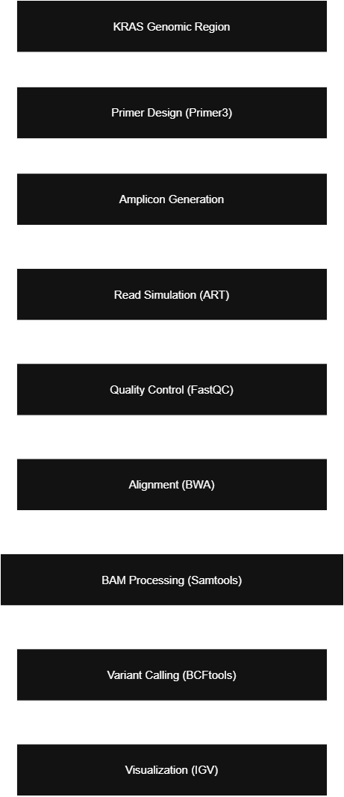

# KRAS Targeted NGS Pipeline

## Project Overview

This project implements an end-to-end targeted Next-Generation Sequencing (NGS) analysis pipeline to detect mutations in **KRAS exon 2**, a clinically relevant hotspot region in cancer genomics.

The workflow includes:

- Primer design
- Amplicon generation
- NGS read simulation
- Quality control
- Alignment to reference
- Variant calling
- Visualization using IGV
- Biological interpretation

---

## Biological Background

KRAS exon 2 contains codons 12 and 13, which are frequently mutated in colorectal, pancreatic, and lung cancers.

Example mutation simulated in this project:

- Position: Codon 12
- Wild-type codon: **TGG**
- Mutated codon: **TGA**
- Amino acid change: Trp → STOP (non-sense mutation)

---

## Workflow

Data Collection → Simulation → Quality Control → Alignment → Variant Calling → Visualization → Interpretation

---

## Tools Used

- Primer3 (Primer design)
- ART (Read simulation)
- FastQC (Quality control)
- BWA-MEM (Alignment)
- Samtools (BAM processing)
- BCFtools (Variant calling)
- IGV (Visualization)

---

## Results Summary

✔ Successful primer design for KRAS exon 2  
✔ 100% alignment rate  
✔ Single nucleotide mutation detected  
✔ Variant validated visually in IGV  
✔ Correct amino acid interpretation  

---

## Repository Structure

KRAS-targeted-NGS-pipeline/
│
├── primer_design/
│ ├── primers.txt
│ ├── primer3_parameters.txt
│ └── target_region.fa
│
├── simulation/
│ ├── KRAS_exon2_amplicon.fa
│ └── simulated_reads.fastq
│
├── alignment/
│ ├── reference_genome.fa
│ ├── aligned_reads.sam
│ └── sorted_reads.bam
│
├── variant_calling/
│ └── kras_exon2_variants.vcf
│
├── visualization/
│ └── IGV_mutation_view.png
│
├── example_outputs/
│ ├── fastqc_per_base_quality.png
│ ├── kras_exon2_variant_igv.png
│ └── KRAS_exon2_mutant.vcf
│
├── commands/
│ └── pipeline_commands.sh
│
├── report/
│ └── KRAS_targeted_NGS_pipeline_report.pdf
│
└── README.md

## Full Report

📄 See detailed analysis here:

[Download Report](report/KRAS_targeted_NGS_pipeline_report.pdf)

---

## Future Improvements

- Extend to full KRAS gene
- Use real human genome reference (GRCh38)
- Implement GATK-based variant calling
- Add functional annotation (ANNOVAR/VEP)

## Pipeline Diagram

